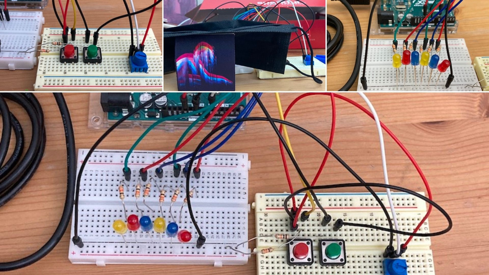
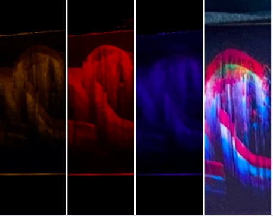
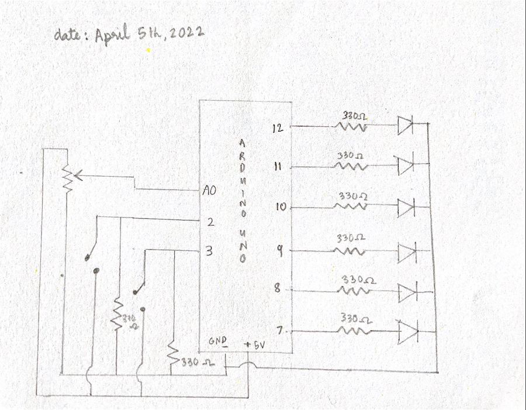

Last week, we learnt about PWM and how we humans perceive lights as being brighter or dimmer when they really aren't- this made me reflect on perception and how we often see things differently from what they actually are. Another example is a point 'moving' when really it's just being redrawn a pixel away from its previous position. For this assignment, I wanted to try to play around with perception using the color of the LEDs, and I did this by attempting to make a still image 'move' as different colored LEDs are lit.

A few weeks ago, I came across the artist [Carnovsky](https://www.carnovsky.com/RGB.htm), who creates murals that shifts as the colors of the lights in the room changes- inspired by this, I found a [simple image](https://shortcut-art.de/wp-content/uploads/2019/01/nude_rgb-1024x707.jpg) online with three colors- red, green and blue- in an attempt to see if I can make a mini Carnovsky inspired picture display. 

The display has the following parts:
- row of LEDs behind the image, each connected to a digital pin
- one switch that changes the mode of the LEDs
- one switch that controls the color of the LEDs in mode 2
- one potentiometer that controls the delay between the LED colors switching in mode 1

When one color is switched on, the parts of the image in that specific color are highlighted, and the colors being switched highlights different parts of the image in succession, giving the impression of the image 'moving'. 

There are two modes to the display: the first rapidly switches between the three colored LEDs, the delay being controlled by the potentiometer. The second mode allows you to change the colors yourself using a switch.

 

There were some difficulties that came along as I worked on the assignment. I could not figure out how to use the switch to change modes, but I came across the built in example on Arduino called StateChangeDetection, which I tailored to suit my needs. Some difficulties arose as I tried to record the project- first, the lights were bright and as a result the photo was not clearly visible- a black mask came in handy, which helped the camera focus on the image. Secondly, the blue lights specifically were extremely bright- it made the whole image look like a blue blob. I was able to fix this by using AnalogWrite instead of DigitalWrite and increasing the PWM.

 

https://user-images.githubusercontent.com/98478196/162598287-3a887586-d421-407c-b077-18d54547fa33.MOV

..
