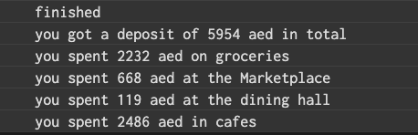

For this assignment, I tried to visualize data downloaded from the NYUAD mealplans page, which has the date, amount and description of every campus dirham I spent. This is how it looked in the end:

The graph visualizes my spending across time and different outlets. Besides learning that I drink way too much coffee, this assignment really helped me understand how to effectively use arrays- when I used arrays to depict the previous x and y positions in order to draw the line, I found it much easier to write the code. I do wish I realized it earlier though, and I think using arrays for the different colors would also have really helped.

