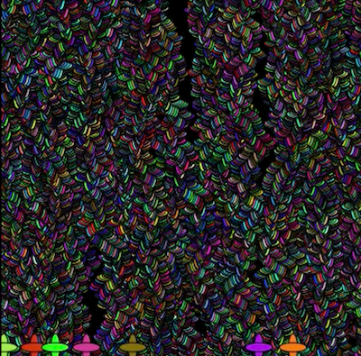
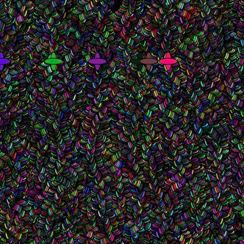

Here are some screenshots of my artwork: 

 

*A little bit about the process:*

- Initially, I wanted to imitate the growth of vines using object oriented programming. During the process, however, I loved the effect the flower created when moving up by a pixel- I decided to work with that effect instead.
- After our conversation regarding the use of random values in code, I wanted to try it because I hadn't experimented with it much for my previous assignments. I really liked the fact that I could make my vines grow in an expected way in a variety of colors, which to me represented growth in real life and had an organic quality.
- One of the biggest challenges personally was creating the class itself- it took me some time to figure out what functions and variables to create and use.

