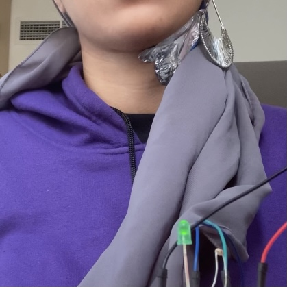

For this assignment, I created a switch that closes every time my earring touches a piece of aluminum on my neck. 

Initially, I tried creating a switch that used human touch itself as a conductor- I had taken a class in my Freshman year (called Circuit Breakers), in which we often used touch to close circuits, so that the person themself was part of the circuit. But I was not able to make this work with the circuit I built this week with Arduino- perhaps because the voltage was too low. 

While looking for other conducting material around my room, I found a metal earring that would work perfectly for a switch. It also dangled, making it easy to move. I also found a piece of aluminum foil from a chocolate wrapper that would work perfectly for the other end of the switch. I stuck the foil onto my neck and connected it and the earring with wires to the breadboard, so that the circuit would be closed every time the earring touched the aluminum. 

 

I wish I had a way to make the aluminum look less prominient or use another material that doesn't make me look part-cyborg. I experimented with using just a few strips of wire, but it didn't work very well.

One difficulty I had was with making the wire stay connected to the earring. I then found alligator clips that made my job much easier, and made sure the earring was connected to power throughout. 

While my switch isn't the most practical, I really enjoyed the result- I liked seeing the light flicker in response to my movement, and this is a concept that I might adopt to get random flickers for projects in the future. 
