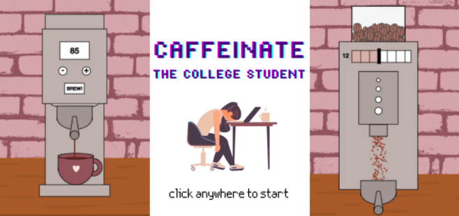

For the midterm project, I decided to stick to my recurrent coffee theme and create a game based on the coffee brewing process. The idea was to have a game where the player tries to create a good cup of coffee by making a set of decisions, from grind size to brew temperature, and a good cup of coffee would mean that the player has won the game. I also thought it would be fun to call it 'caffeinate the college student', and give it the premise of the player being asked to make coffee to help a college student survive finals week. 

The game has the following parts:
- start screen: title
- instructions
- grinder: measure amount & choose grind size 
- coffee machine: choose temperature
- results & end screen

[Click here](https://editor.p5js.org/noorajabir/sketches/7erJ7QDXq) to play the game.

Making the game came with a lot of challenges, many which are documented in more detail in my [project journal](https://github.com/noorajabir/IntroToIM/blob/main/Midterm/journal.md). Some broader observations to incorporate in future projects are as follows:

1. Knowing when to use arrays, functions and classes- a lot of times, I did simple things in a convoluted manner, before realizing that effectively using arrays or functions could've saved me time and effort.
2. Using built in functions and variables- I did this to a small extent in this project, but I wish I used it more- it would've made resizing and debugging much easier
3. Build mechanics first and then work on design- frames where I focused on making everything 'look right' took much more time than those I initially focused on 'working right', which I think is something to keep in mind moving forward.

Resources Used:

1. [Happy Coding](https://happycoding.io/): I referred to a lot of examples and tutorials on this website, it explains things in an easy to understand manner and has very helpful examples too.
2. [Online PNG Tools](https://onlinepngtools.com/change-png-color): Was very useful in editing graphics to create a specific aesthetic for the game.
3. [Quick Sounds](https://quicksounds.com/) and [Sounds MP3](https://sounds-mp3.com/): For sound effects
4. [Canva](https://www.canva.com/): For graphics
